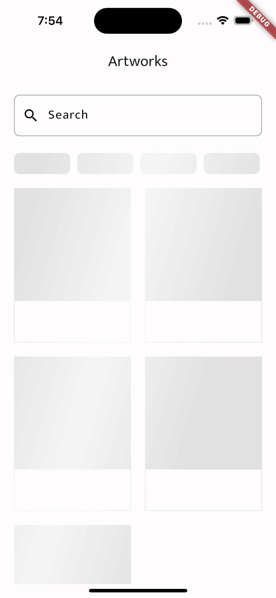
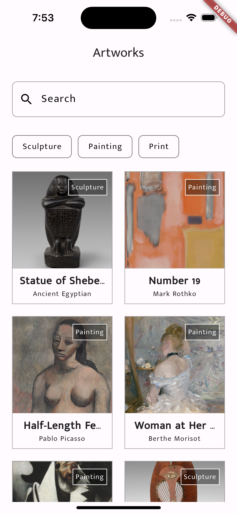
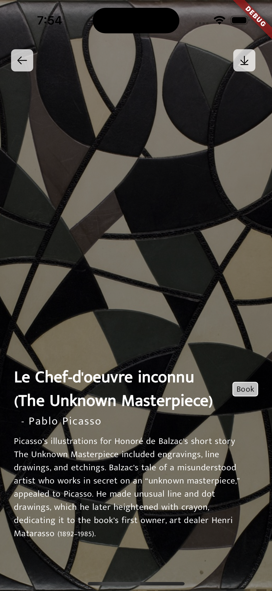

# ArtWorks

Artworks is a flutter application.

## Getting Started

This project is a challenge app by CityScope.

### API
#### Art Institute of Chicago Apis
https://api.artic.edu/docs/#collections

### Technicals
1. Flutter
2. Riverpod
3. Dio
4. APIs 
5. Clean Project Structue

## Feature List
1. Pixel Perfect UI
2. API Integration
3. Paginated APIs
4. Minimal 3rd party dependencies
5. Riverpod based state management
6. API caching on Isar Store

## Screenshots
| Loading   | Home Screen   | Detailed Screen                                |
|---        |---            |---|
|   |    |    |
